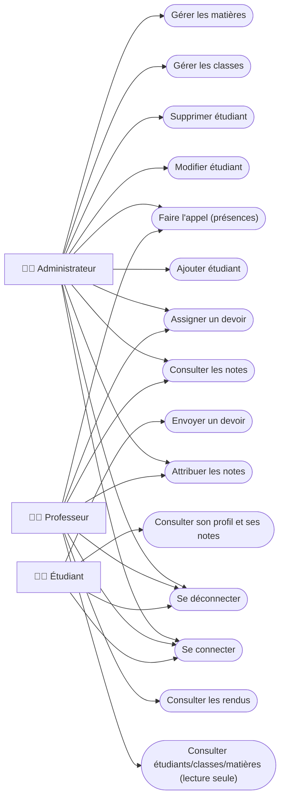
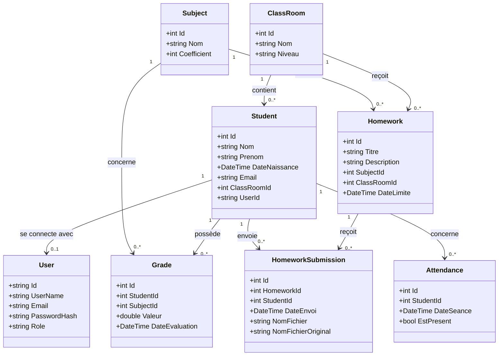
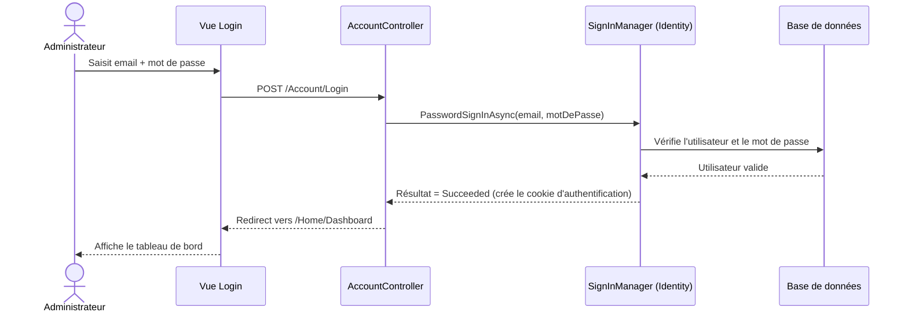
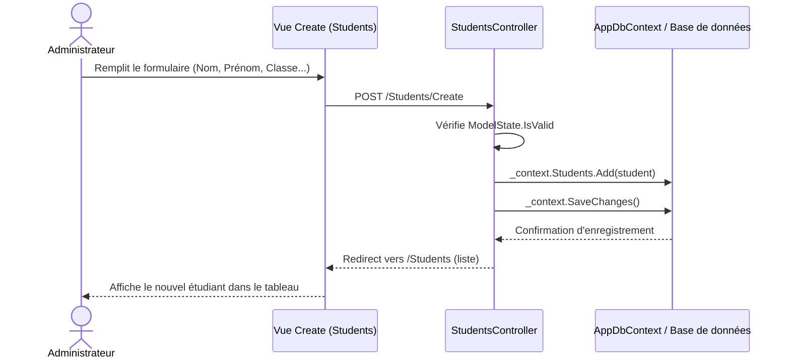
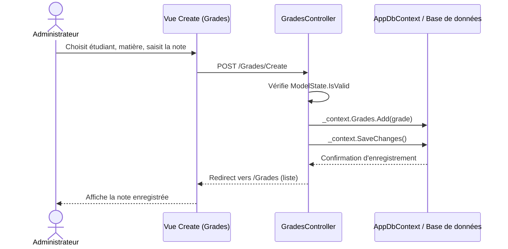
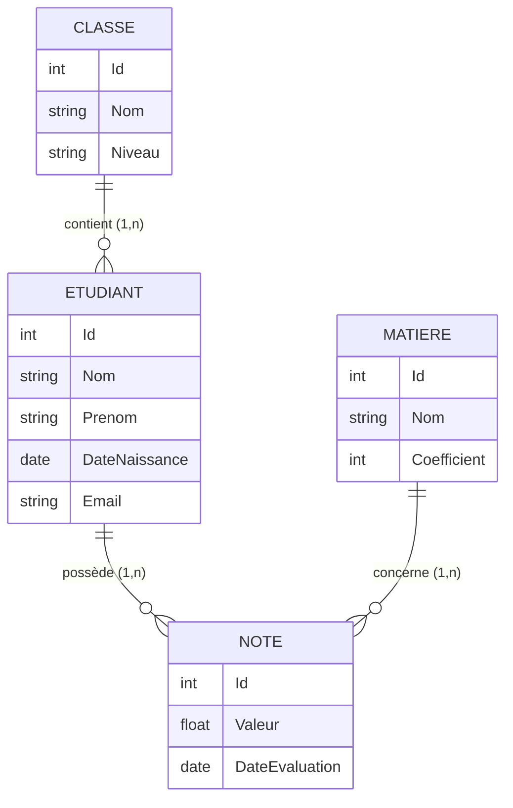

# Conception UML — Application de Gestion Scolaire

> Projet étudiant ASP.NET MVC — Kelly, Koita, Dougouré, Cécile
> Niveau : débutant (≈12h de cours ASP.NET) — code volontairement simple.

## Sommaire

1. Diagramme de cas d'utilisation
2. Diagramme de classes
3. Diagrammes de séquence (Connexion, Ajout étudiant, Ajout note)
4. MCD (Merise)
5. Modèle relationnel
6. Répartition du travail et organisation Git (anti-conflits)

---

## 1. Diagramme de cas d'utilisation

**Mise à jour (extension rôles) :** l'application gère maintenant 3 acteurs distincts, avec des droits différents.



**Remarques pédagogiques (à dire au professeur) :**
- Tous les cas d'usage sauf « Se connecter » nécessitent implicitement d'être authentifié (relation `<<include>>` vers « Se connecter »). Techniquement, cela correspond à l'attribut `[Authorize]` (avec ou sans `Roles = "..."`) posé sur les contrôleurs.
- Le Professeur a un accès **complet** aux notes/devoirs/présences, mais **lecture seule** sur étudiants/classes/matières (pas de UC3, UC4, UC5, UC6, UC7 pour lui).
- L'Étudiant n'a accès qu'à **ses propres** données (son profil, ses notes, ses devoirs) — jamais à celles des autres étudiants.

---

## 2. Diagramme de classes

**Mise à jour (extension rôles) :** `User` porte maintenant un rôle (Administrateur/Professeur/Etudiant) et `Student` est relié à son compte `User` via `UserId`. Deux nouvelles classes : `Homework` (devoir) et son association `HomeworkSubmission` (rendu), plus `Attendance` (présence).



**Notes :**
- `User` correspond au compte Identity (table `AspNetUsers`). Chaque compte a un **rôle** (Administrateur, Professeur ou Etudiant), géré par les tables Identity `AspNetRoles`/`AspNetUserRoles`.
- `Student.UserId` est la clé qui relie la fiche étudiant (créée par l'administrateur) à son compte de connexion (créé automatiquement en même temps).
- `Grade` est la classe association entre `Student` et `Subject` : chaque note relie un étudiant à une matière.
- `HomeworkSubmission` est la classe association entre `Homework` et `Student` : chaque rendu relie un devoir à l'étudiant qui l'a envoyé.
- Une classe (`ClassRoom`) contient plusieurs étudiants, mais un étudiant appartient à une seule classe.

---

## 3. Diagrammes de séquence

### 3.1 Connexion



### 3.2 Ajout d'un étudiant



### 3.3 Attribution d'une note



> **Note :** le MCD, le modèle relationnel et les diagrammes de séquence ci-dessous couvrent le cœur du projet (étapes 1 à 6). L'extension "espaces par rôle" (Professeur/Étudiant, Devoirs, Présences) est documentée en détail dans `docs/fiches/Kelly-Extension-Roles.md`, avec son propre diagramme de classes mis à jour en section 2.

---

## 4. MCD (Modèle Conceptuel de Données — Merise)



**Lecture des cardinalités :**
- Une **Classe** contient 0 à n **Étudiants** ; un **Étudiant** appartient à exactement 1 **Classe**.
- Un **Étudiant** possède 0 à n **Notes** ; une **Note** concerne exactement 1 **Étudiant**.
- Une **Matière** concerne 0 à n **Notes** ; une **Note** concerne exactement 1 **Matière**.
- `NOTE` est l'entité associative qui matérialise la relation n-n conceptuelle entre `ETUDIANT` et `MATIERE`.

---

## 5. Modèle relationnel

Notation Merise classique : `Table(clé primaire soulignée, ..., #clé étrangère)`

```
ClassRooms ( Id, Nom, Niveau )

Students ( Id, Nom, Prenom, DateNaissance, Email, #ClassRoomId )

Subjects ( Id, Nom, Coefficient )

Grades ( Id, Valeur, DateEvaluation, #StudentId, #SubjectId )

AspNetUsers ( Id, UserName, Email, PasswordHash, ... )   -- généré automatiquement par ASP.NET Identity
```

Contraintes de clé étrangère :
- `Students.ClassRoomId` → `ClassRooms.Id`
- `Grades.StudentId` → `Students.Id`
- `Grades.SubjectId` → `Subjects.Id`

---

## 6. Répartition du travail et organisation Git (anti-conflits)

### 6.1 Tableau récapitulatif

| Étudiant  | Responsabilité                  | Fichiers touchés (uniquement)                                                                 |
|-----------|----------------------------------|-------------------------------------------------------------------------------------------------|
| Kelly     | Auth, Layout, Dashboard          | `Program.cs`, `Data/AppDbContext.cs`, `Controllers/AccountController.cs`, `Controllers/HomeController.cs`, `Views/Shared/_Layout.cshtml`, `Views/Home/*`, `Views/Account/*` |
| Koita     | Gestion des étudiants (CRUD)     | `Models/Student.cs`, `Controllers/StudentsController.cs`, `Views/Students/*`                    |
| Dougouré  | Gestion des classes et matières  | `Models/ClassRoom.cs`, `Models/Subject.cs`, `Controllers/ClassRoomsController.cs`, `Controllers/SubjectsController.cs`, `Views/ClassRooms/*`, `Views/Subjects/*` |
| Cécile    | Gestion des notes                | `Models/Grade.cs`, `Controllers/GradesController.cs`, `Views/Grades/*`                          |

### 6.2 Pourquoi les conflits Git seront presque inexistants

Deux fichiers sont "partagés" par nature dans une appli MVC : `Data/AppDbContext.cs` (liste des `DbSet<>`) et `Views/Shared/_Layout.cshtml` (menu latéral). Pour éviter que tout le monde y touche :

- **Étape 1 (Architecture, Kelly)** crée d'un coup :
  - les 4 classes modèles **en version minimale** (`Student`, `ClassRoom`, `Subject`, `Grade` avec juste `Id` + 1-2 champs de base) ;
  - `AppDbContext` avec les 4 `DbSet<>` déjà déclarés ;
  - la sidebar complète du `_Layout.cshtml` avec **tous** les liens de menu (Dashboard, Étudiants, Classes, Matières, Notes), même si les pages n'existent pas encore.
- Ensuite, **chaque étudiant complète uniquement son propre modèle** (ajoute ses champs, ses validations) et crée son contrôleur + ses vues. Il ne touche plus jamais `AppDbContext.cs` ni `_Layout.cshtml`.
- Résultat : Koita, Dougouré et Cécile ne modifient jamais un fichier que quelqu'un d'autre modifie aussi.

### 6.3 Organisation des branches

```
main
 ├─ feature/auth-kelly          (Étapes 1 et 2)
 ├─ feature/students-koita      (Étape 3)
 ├─ feature/classes-subjects-dougoure   (Étapes 4 et 5)
 └─ feature/grades-cecile       (Étape 6)
```

Règle : chaque branche est fusionnée (Pull Request) dans `main` **avant** que la branche suivante ne démarre, dans l'ordre des étapes. Comme cet ordre correspond exactement à l'ordre de génération du projet (Étape 1 → 6), il n'y a jamais deux personnes qui modifient les fichiers partagés en même temps.

### 6.4 Convention de messages de commit

Format : `type(portée): description courte`

Exemples :
- `feat(auth): ajout de la page de connexion`
- `feat(students): ajout du CRUD étudiant`
- `feat(classes): ajout du CRUD classes`
- `feat(grades): ajout de l'attribution des notes`
- `fix(students): correction de la validation email`

---

## Prochaine étape

Conception validée. Prête à démarrer l'**Étape 1 : Architecture du projet** (solution ASP.NET MVC, `Program.cs`, `AppDbContext`, modèles minimaux, layout + sidebar, connexion à la base de données) dès votre feu vert.
